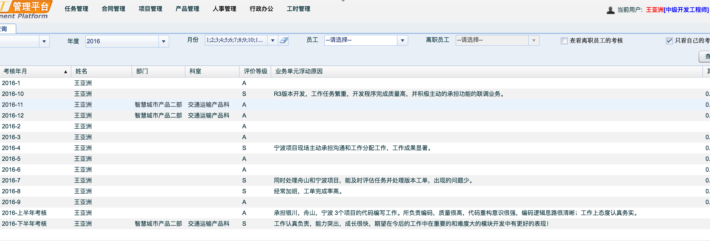
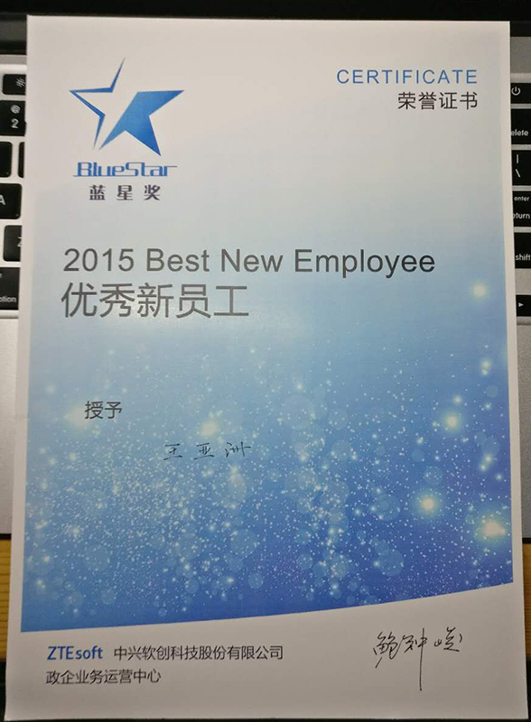

# 联系方式

- 手机：18251859385
- Email：asiawang1991@outlook.com
- QQ：871083369

---

# 个人信息

 
 - 王亚洲/男/1991 
 - 本科/南京工业大学/计算机科学与技术专业 
 - 工作年限：2年
 - 个人博客：http://asiawang.me ( `hexo` + `gh pages`)
 - Github：https://github.com/asiareal ( `之前too young too simple，起的名字太挫，又注册了个` )
 - 期望职位：Web前端中高级程序员
 - 期望薪资：税前月薪10k~15k，特别喜欢的公司可例外
 - 期望城市：南京

---

# 工作经历

## ZTEsoft （ 2015年7月 ~ 现在 ）

### ZSmartCity诱导屏信息发布系统
2017年初参加了宁波诱导屏发布系统的开发工作，作为web核心开发人员，我主要负责诱导屏复杂的文本编辑器的开发。经过两周的钻研和开发，最终不仅保质保量完成了开发任务，
而且额外支持了编辑器的皮肤可定制，初始化时工具栏任意配置，按需加载，支持编辑和预览模式等，大大方便了系统中不同模块灵活调用，节约了开发和联调时间，得到大家一致好评。
除此之外建设性提出不同分辨率下，多诱导屏批量编辑的解决方案，获得设计人员一致认可，最终完成实现多分辨率编辑模式，效果很赞。
因为该模块开发时架构合理，扩展性好，也被其他团队广泛借鉴和使用。

- 主要前端技术：`Backbone`, `require`, `Handlebars`, `less`, `jQuery`, `bootstrap`, `grunt`等

### ZSmartCity大屏展示 
大屏展示系统，需要展示大量指标，大量的[echarts](http://echarts.baidu.com/)报表。其他开发人员上来直接一个报表一个`view`，
每个`view`代码里都设置了一长串的[echarts](http://echarts.baidu.com/)的`option`参数，设置报表的风格样式以满足美工的效果图。然后接下来就是copy来copy去。

而我的做法，先按照美工配色风格做了一套[echarts](http://echarts.baidu.com/)主题，然后新建了一个基本的`BaseView`使用了这套主题，接着基于`BaseView`扩展不同的`bar`柱状图，
`line`曲线图，`pie`饼图等的基础`View`，每个`View`中都有该种类型的一些通用的方法。最后业务`View`分别继承相对应的图表`View`，实现其中暴露的`init`和`rendered`钩子方法，
业务代码层更专注后台取数据，塞数据，代码非常简洁。开发过程中我也做了积极的推广，好多同事最后的一些图表都继承了我的基础`View`，获得大家点赞，好评。这个过程中我也获得满满成就感，
激励我做更多更好用的东西。

- 主要前端技术：`Backbone`, `require`, `Handlebars`, `less`, `jQuery`, `bootstrap`, `grunt`, `echarts`等 

## 焦点科技股份有限公司 `实习`（ 2014年7月 ~ 2014年10月 ）

### 新一站微信抢红包项目 
2014年入职焦点科技新一站部门实习，期间承担的主要项目是微信抢红包功能的所有前端页面，大概有10几个左右。保质保量完成任务，通过了各个手机平台测试。
获得自己导师和领导认可，为自己前台开发打下了坚实的基础。

---

# 自我描述
我善于总结以及模块封装，擅长增加代码复用度。
乐于分享自己封装的通用模块，开发公共组件，帮助同事提高工作效率，减少他们的工作量，会使自己获得很大成就感。
我认真完成工作的同时，经常会有一些发明创造，这些idea会经常帮助开发同事更优雅的完成开发任务，甚至帮助到测试人员更多场景测试。

经过几年工作经验锻炼，提高了自己工作沟通能力，扎实了自己前端的工作技能。工作中能极大限度还原美工效果图，能自己独立开发前端组件，除此之外时刻关注学习前端前沿技术。了解 mvvm框架，例如vue，react等，熟悉es6，能够熟练使用grunt，webpack，gulp等构建前端项目。

工作中认真负责，责任感强，工作第一年获得优秀新员工蓝星奖，获得极大鼓励，多次月度和半年考核为S（S为绩效最高等级）

# 评价&证书
`考核评价截图`

`优秀新员工截图`

# 致谢
感谢您花时间阅读我的简历，期待能有机会和您共事。
