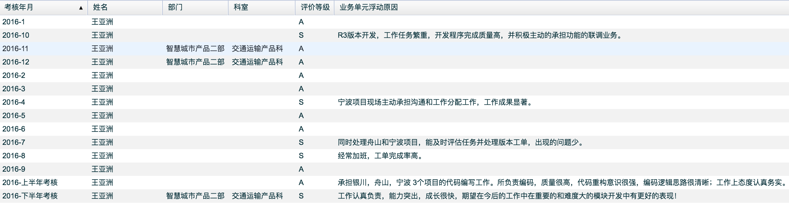

# 联系方式

- 手机：18251859385
- Email：asiawang1991@outlook.com
- QQ：871083369

---

# 个人信息

 
 - 王亚洲/男/1991
 - 本科/南京工业大学/计算机科学与技术专业
 - 工作年限：2年
 - 个人博客：http://asiawang.me
 - Github：https://github.com/asiareal
 - 期望职位：Web前端高级工程师
 - 期望薪资：税前月薪10k+，特别喜欢的公司可例外
 - 期望城市：南京

---

# 工作经历

## ZTEsoft （ 2015年7月 ~ 现在 ）

### ZSmartCity 诱导屏信息发布系统
2017年初参加了诱导屏发布系统产品前端的改造和开发工作。当时的背景是，老诱导屏发布系统是基于`Flex`（Adobe Flex）开发的，整个系统卡到爆。原系统的代码结构混乱，仅编辑器单文件的核心代码就有上万行，维护成本大。领导最终开会决定，要对整个系统的前端部分重新进行改造。摒弃原来的`Adobe Flex`，采用新的html Web技术重新进行开发。

最终这个任务派给了我，让我主要牵头，带领两个实习生完成整个前端的改造。

开发人员：

- web开发人员：我 + 2名实习生
- GIS开发人员：1名

技术选型：

- `Backbone`（前端mvc）
- `RequireJS`（代码模块化）
- `Handlebars`（前端模版引擎）
- `LESS` (样式)
- `Grunt` (构建工具)

整个任务中，我主要负责诱导屏最复杂的文本编辑器的重新架构与开发。老系统编辑器的代码一个文件上万行的代码，满天的全局变量，阅读性维护性很差。因为系统比较久老，之前研发的人员已经离职，参考意义不大。只是了解基本原理后，我基于backbone重新进行设计与架构，一行一行代码从头开始开发。一周完成了编辑器框架核心代码内容，又用一周时间完成了编辑器各个模块功能的开发。最终不仅保质保量完成了开发任务，而且额外支持了编辑器的皮肤可定制，初始化时工具栏工具任意配置，文件按需加载，支持编辑和预览模式等。大大方便了系统中不同模块灵活调用，节约了开发和联调时间，得到大家一致好评。

除此之外建设性提出，针对不同分辨率诱导屏批量编辑的解决方案，获得设计人员赞赏和认可，接下来扩展实现诱导屏多分辨率编辑模式，操作灵活高效。因为该模块开发时架构合理，扩展性好，现在已被其他团队广泛借鉴和使用。

### 宁波大屏展示项目
大屏展示系统，需要展示大量指标，大量的[echarts](http://echarts.baidu.com/)报表。其他开发人员通常做法直接一个报表一个视图，每个视图代码里都设置了一长串的[echarts](http://echarts.baidu.com/)的`option`，设置报表的风格样式以满足美工的效果图。然后每个视图中再copy一遍。

而我的做法，以面向对象继承思想处理，先按照美工配色风格做了一套[echarts](http://echarts.baidu.com/)主题，然后新建了一个基本的`BaseView`使用了这套主题，接着基于`BaseView`扩展不同的`bar`柱状图，`line`曲线图，`pie`饼图等的基础视图，每个视图中都有该种类型的一些通用的方法。最后业务视图分别继承相对应的图表视图，只需要实现其中暴露的`init`和`rendered`钩子方法即可。

这样业务代码层更专注后台取数据，塞数据，代码非常简洁。开发过程中我也做了积极的推广，好多同事最后的一些图表都继承了我的基础视图，获得大家点赞，好评。

在开发过程中我不仅注重自己的任务，并且能够很敏锐的将一些通用的东西提取出来，做封装帮助大家更快更优雅的完成开发任务。

### uboss宁波交委项目
2016年3月份，接手宁波教委项目。此项目由于现场开发经理人事变动，需求混乱导致这个项目延期比较严重，部门决定紧急派人员（1名设计，3名开发）去现场按照业主需求，快速开发解决，当时临时安排我担任现场开发小组组长，主要任务是包括开发，分配开发任务，并协助评估设计功能和开发时长等。这是我第一次担这么重的任务，压力还是非常大，在所内人员下班时间段，我们在现场基本上是孤军奋战，还要保证整个开发任务及时完成。身为web开发人员，遇到紧急情况还要承担GIS模块，后台redis数据实时接入与读取，等等不擅长的领域的开发。现场一般遇到比较大的困难，自己都主动承担，带头研究攻破。经过两周的冲刺，完成项目初验，最后得到了现场的高度评价，现场说，“我们这个团队，经过短短两周，就在一座废墟上面建起了高楼大厦！”当时觉得几天没日没夜的加班，一切都值了。

## 焦点科技股份有限公司 `实习`（ 2014年7月 ~ 2014年10月 ）

### 新一站微信抢红包项目
2014年7月份入职焦点科技新一站部门实习，2周学习后，通过导师任务考核。开始参与部门一些任务。

实习后期可以独立承担前端页面开发。实习期间负责的主要项目，是微信抢红包功能，我负责了该项目所有前端页面，大概有10几个左右。保质保量完成任务，参与和后端同学数据联调，后通过了各个手机平台测试，成功上线。

---

# 自我描述
我善于总结以及模块封装，擅长增加代码复用度。乐于分享自己封装的通用模块，开发公共组件，帮助同事提高工作效率，减少他们的工作量。

目前在公司主要工作，一些复杂前端模块的开发，项目前端框架的搭建维护。ps：现在所在公司并没有区分前后端开发，培养人才模式是一专多能，我的专长是前端开发，写后端代码也无压力。项目后端框架主要为`springMVC`。也曾为部门后台框架封装Ftp上传下载在线预览等公共接口方法。

经过这几年工作经验锻炼，提高了自己工作沟通能力，扎实了自己前端的工作技能。工作中能极大限度还原美工效果图，能自己独立开发前端组件，除此之外时刻关注学习前端前沿技术。了解 mvvm框架，例如vue，react等，熟悉es6，能够熟练使用grunt，webpack，gulp等构建前端项目。

工作中认真负责，责任感强，工作第一年获得优秀新员工蓝星奖，获得公司总经理鼓励。工作中多次月度和半年考核为S（S为绩效最高等级）

# 评价&证书
`考核评价截图`

`优秀新员工截图`

# 致谢
感谢您花时间阅读我的简历，期待能有机会和您共事。
